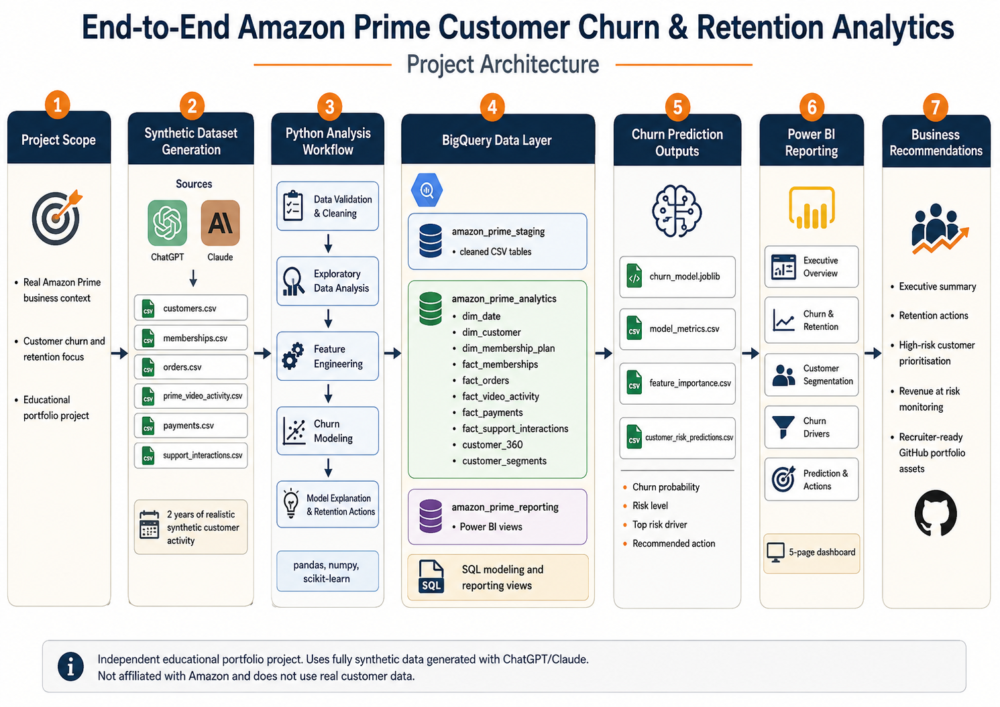
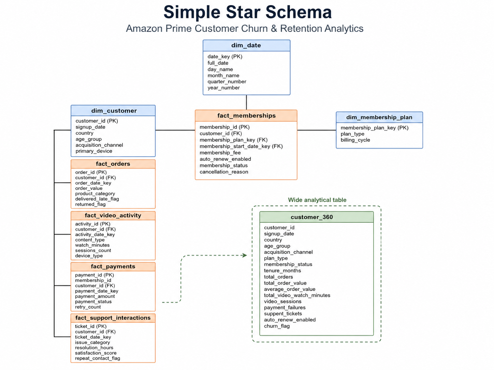
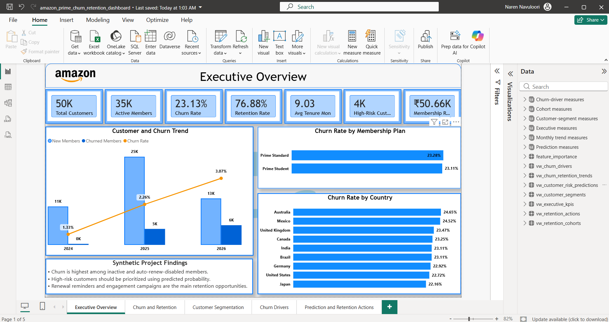
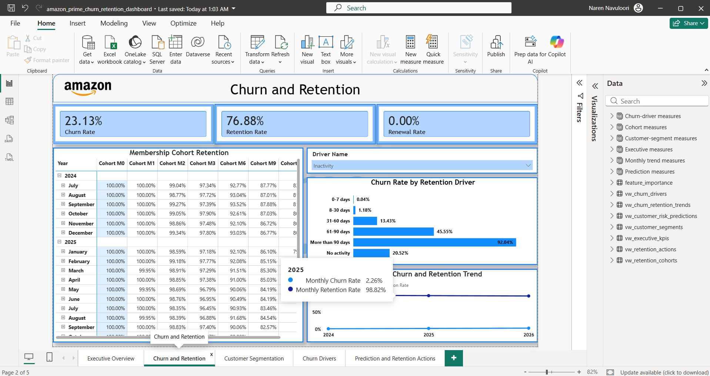
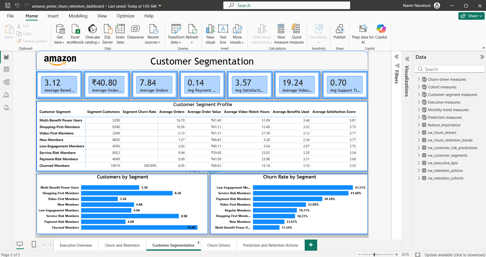
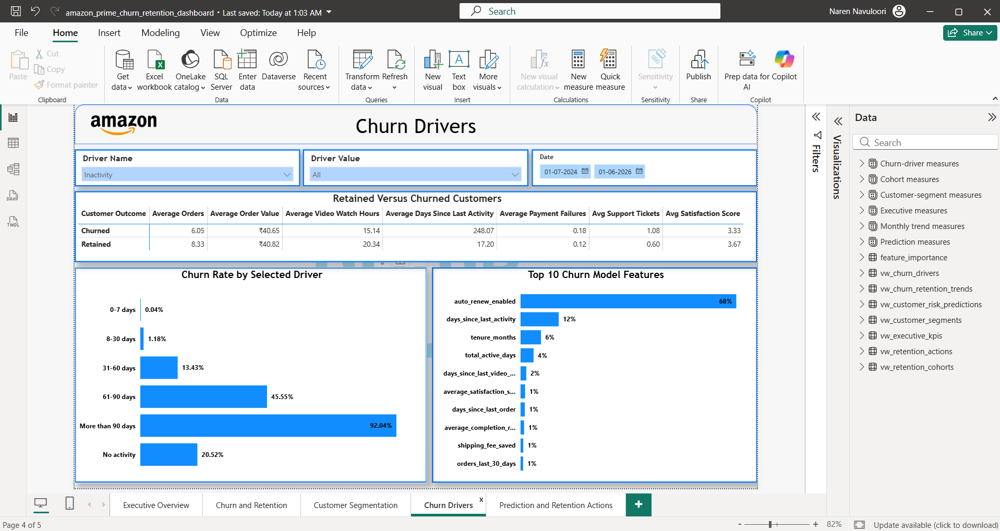
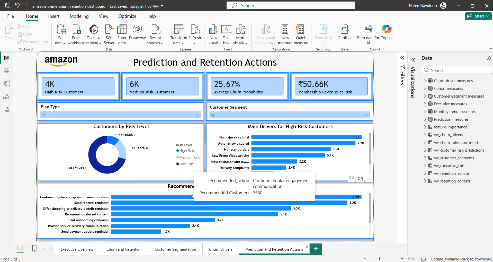

# Amazon Customer Churn & Retention Analytics

An end-to-end customer analytics project that combines **Python, BigQuery, machine learning, and Power BI** to analyse membership behaviour, identify churn drivers, predict customers at risk of leaving, and recommend targeted retention actions.

> **Important:** This is an independent educational portfolio project. It is not affiliated with Amazon and does not use real, proprietary, confidential, or actual Amazon customer data. All data used in this project is fully synthetic.

---

## Project Summary

Customer churn reduces recurring membership revenue and long-term customer value. This project was built to answer four practical business questions:

1. Which customers are most likely to churn?
2. What behaviours are associated with churn?
3. Which customer groups should be prioritised?
4. What retention action should be recommended for each customer?

The project follows the complete analytics lifecycle:

```text
Synthetic Data
      ↓
Data Validation and Cleaning
      ↓
Exploratory Data Analysis
      ↓
BigQuery Data Modelling
      ↓
Customer KPI, Churn and Retention Analysis
      ↓
Feature Engineering
      ↓
Machine-Learning Churn Prediction
      ↓
Risk Segmentation and Retention Actions
      ↓
Power BI Dashboard
      ↓
Business Recommendations
```

---

## Project Architecture



The project uses three main data layers in BigQuery:

| Layer | Purpose |
|---|---|
| `amazon_prime_staging` | Stores cleaned source tables |
| `amazon_prime_analytics` | Stores dimensions, facts, `customer_360`, segments, and prediction outputs |
| `amazon_prime_reporting` | Stores final Power BI reporting views |

---

## Business Objectives

The analysis was designed to:

- Measure customer churn and retention.
- Monitor active, churned, and high-risk customers.
- Identify important churn drivers.
- Compare retained and churned customer behaviour.
- Analyse monthly retention and membership cohorts.
- Create simple customer segments.
- Predict churn during the next 30 days.
- Estimate membership revenue at risk.
- Recommend one retention action for each at-risk customer.
- Present findings in a five-page Power BI dashboard.

---

## Dataset Overview

The project uses six related synthetic CSV files covering approximately two years of customer activity.

| Dataset | Description |
|---|---|
| `customers.csv` | Customer profile, acquisition, location, and device information |
| `memberships.csv` | Membership plan, billing, renewal, cancellation, and status data |
| `orders.csv` | Shopping orders, delivery, returns, and savings |
| `prime_video_activity.csv` | Video watch time, sessions, completion, and content activity |
| `payments.csv` | Membership payments, failures, retries, and refunds |
| `support_interactions.csv` | Support tickets, resolution time, satisfaction, and repeat contact |

### Dataset Scale

| Item | Volume |
|---|---:|
| Customers | 50,000 |
| Raw records across six files | 1,211,215 |
| Cleaned records | 1,209,920 |
| Customers eligible for churn modelling | 35,193 |
| Input features used for modelling | 34 |
| Target | `churn_next_30_days` |

The machine-learning scoring date is **May 31, 2026**.

- Feature window: March 3, 2026 to May 31, 2026
- Prediction window: June 1, 2026 to June 30, 2026
- Reporting date: June 30, 2026

---

## Technology Stack

| Area | Tools |
|---|---|
| Data generation | ChatGPT and Claude |
| Data processing | Python, pandas, NumPy |
| Visual analysis | Matplotlib |
| Cloud data warehouse | Google BigQuery |
| SQL analysis | GoogleSQL |
| Machine learning | scikit-learn |
| Model storage | joblib |
| Reporting | Microsoft Power BI |
| Development | Jupyter Notebook, VS Code |
| Version control | Git and GitHub |

---

## Repository Structure

```text
Amazon-Customer-Churn-Retention-Analytics/
│
├── README.md
├── requirements.txt
│
├── data/
│   ├── raw/
│   │   ├── customers.csv
│   │   ├── memberships.csv
│   │   ├── orders.csv
│   │   ├── prime_video_activity.csv
│   │   ├── payments.csv
│   │   └── support_interactions.csv
│   │
│   ├── processed/
│   │   ├── customers_cleaned.csv
│   │   ├── memberships_cleaned.csv
│   │   ├── orders_cleaned.csv
│   │   ├── prime_video_activity_cleaned.csv
│   │   ├── payments_cleaned.csv
│   │   ├── support_interactions_cleaned.csv
│   │   └── churn_model_dataset.csv
│   │
│   └── data_dictionary.md
│
├── notebooks/
│   ├── 01_data_validation_and_cleaning.ipynb
│   ├── 02_exploratory_data_analysis.ipynb
│   ├── 03_feature_engineering.ipynb
│   ├── 04_churn_modeling.ipynb
│   └── 05_model_explanation_and_retention_actions.ipynb
│
├── sql/
│   ├── 01_create_bigquery_datasets.sql
│   ├── 02_create_staging_tables.sql
│   ├── 03_data_quality_checks.sql
│   ├── 04_build_analytics_model.sql
│   ├── 05_customer_kpi_analysis.sql
│   ├── 06_churn_driver_analysis.sql
│   ├── 07_retention_and_cohort_analysis.sql
│   ├── 08_customer_segmentation.sql
│   └── 09_create_power_bi_views.sql
│
├── models/
│   ├── churn_model.joblib
│   ├── model_metrics.csv
│   └── feature_importance.csv
│
├── power-bi/
│   ├── amazon_prime_churn_retention_dashboard.pbix
│   └── dashboard_screenshots/
│       ├── 01_executive_overview.png
│       ├── 02_churn_retention.png
│       ├── 03_customer_segments.png
│       ├── 04_churn_drivers.png
│       └── 05_prediction_actions.png
│
├── docs/
│   ├── project_definition.md
│   ├── business_requirements.md
│   ├── kpi_dictionary.md
│   ├── churn_definition.md
│   ├── data_model.md
│   └── executive_summary.md
│
└── images/
    ├── project_architecture.png
    └── star_schema.png
```

---

## Data Validation and Cleaning

The first notebook checks and cleans all six raw files.

Main checks include:

- Row counts and column names
- Data types
- Duplicate records
- Duplicate primary keys
- Missing primary keys
- Missing foreign keys
- Invalid date sequences
- Negative monetary values
- Negative watch time
- Invalid membership statuses
- Invalid payment statuses
- Orders before customer signup
- Payments without memberships
- Support tickets without customers

### Cleaned Row Counts

| Table | Rows |
|---|---:|
| Customers | 50,000 |
| Memberships | 55,000 |
| Orders | 399,976 |
| Prime Video activity | 549,970 |
| Payments | 124,984 |
| Support interactions | 34,990 |
| **Total** | **1,209,920** |

---

## Exploratory Data Analysis

The EDA notebook explores customer, membership, shopping, video, payment, and support behaviour.

Examples of analysis include:

- Customer distribution by country and acquisition channel
- Active versus churned memberships
- Churn by plan and tenure
- Order frequency and spending behaviour
- Prime Video usage
- Payment failures
- Support tickets and satisfaction
- Retained-versus-churned customer comparison

The analysis showed meaningful synthetic patterns:

- Retained customers placed more orders.
- Retained customers watched more Prime Video.
- Customers with payment failures had higher churn.
- Customers with complaints had higher churn.
- Customers with lower satisfaction showed higher churn.
- Customers with auto-renewal disabled showed much higher churn.

These findings are synthetic project results, not actual Amazon findings.

---

## BigQuery Data Model

The analytics layer uses a simple star schema.



### Dimension Tables

- `dim_date`
- `dim_customer`
- `dim_membership_plan`

### Fact Tables

- `fact_memberships`
- `fact_orders`
- `fact_video_activity`
- `fact_payments`
- `fact_support_interactions`

### Customer-Level Tables

- `customer_360`
- `customer_segments`
- `customer_risk_predictions`

`customer_360` contains one row per customer and combines profile, membership, shopping, video, payment, support, and churn information.

This table is the main source for:

- SQL analysis
- Customer segmentation
- Feature engineering
- Machine learning
- Power BI reporting

Detailed modelling information is available in [`docs/data_model.md`](docs/data_model.md).

---

## SQL Analysis

The SQL workflow is organised into nine scripts.

| Script | Purpose |
|---|---|
| `01_create_bigquery_datasets.sql` | Creates staging, analytics, and reporting datasets |
| `02_create_staging_tables.sql` | Creates cleaned source tables |
| `03_data_quality_checks.sql` | Runs pass/fail quality checks |
| `04_build_analytics_model.sql` | Creates dimensions, facts, and `customer_360` |
| `05_customer_kpi_analysis.sql` | Calculates business KPIs |
| `06_churn_driver_analysis.sql` | Compares churned and retained customers |
| `07_retention_and_cohort_analysis.sql` | Calculates retention and cohort metrics |
| `08_customer_segmentation.sql` | Creates rule-based customer segments |
| `09_create_power_bi_views.sql` | Creates final Power BI reporting views |

### Main Customer KPIs

- Total customers
- Active members
- Churned members
- Churn rate
- Retention rate
- Renewal rate
- Average tenure
- Auto-renewal rate
- Average order value
- Average video watch hours
- Payment failure rate
- Support-contact rate
- Average satisfaction score

---

## Customer Segmentation

Customers are assigned to one simple, explainable segment.

| Segment | Description |
|---|---|
| Multi-Benefit Power Users | Strong shopping, video, and multi-benefit engagement |
| Shopping-First Members | High shopping activity with lower video usage |
| Video-First Members | High Prime Video activity with lower shopping activity |
| New Members | Membership age below 90 days |
| Low-Engagement Members | Low activity and recent inactivity |
| Service-Risk Members | Support, satisfaction, or delivery concerns |
| Payment-Risk Members | Payment failures, retries, or renewal problems |
| Churned Members | Cancelled or expired customers |

The rules are intentionally simple so that business users can understand why a customer belongs to a segment.

---

## Feature Engineering

The feature-engineering notebook creates one machine-learning row per eligible customer.

### Membership Features

- `tenure_months`
- `plan_type`
- `auto_renew_enabled`
- `discount_applied`
- `billing_cycle`

### Shopping Features

- `orders_last_30_days`
- `orders_last_90_days`
- `spend_last_90_days`
- `average_order_value`
- `days_since_last_order`
- `late_delivery_rate`
- `return_rate`
- `shipping_fee_saved`

### Prime Video Features

- `watch_minutes_last_30_days`
- `watch_minutes_last_90_days`
- `video_sessions_last_90_days`
- `days_since_last_video_activity`
- `average_completion_rate`

### Payment and Support Features

- `payment_failures_last_90_days`
- `payment_retries_last_90_days`
- `last_payment_failed`
- `support_tickets_last_90_days`
- `average_resolution_hours`
- `average_satisfaction_score`
- `repeat_contact_rate`

### Combined Features

- `benefits_used_count`
- `total_active_days`
- `days_since_last_activity`
- `engagement_score`
- `customer_segment`

### Target

```text
churn_next_30_days
```

- `1` = customer churned during the following 30 days
- `0` = customer did not churn during the following 30 days

Leakage fields such as final membership status, cancellation reason, cancellation date, and churn flag are excluded from the model inputs.

---

## Machine-Learning Models

Three simple classification models were trained and compared:

1. Logistic Regression
2. Random Forest
3. Gradient Boosting

The data was split using:

```text
80% training data
20% testing data
```

Stratification was used because churn is an imbalanced target.

### Model Comparison

| Model | Accuracy | Precision | Recall | F1 Score | ROC-AUC |
|---|---:|---:|---:|---:|---:|
| Logistic Regression | 82.40% | 11.97% | 83.25% | 20.93% | 89.91% |
| Random Forest | 92.46% | 20.07% | 56.85% | 29.67% | 90.70% |
| **Gradient Boosting** | **83.17%** | **12.75%** | **85.79%** | **22.19%** | **91.35%** |

### Selected Model

**Gradient Boosting** was selected because it achieved:

- The highest recall
- The highest ROC-AUC
- A strong ability to rank high-risk customers
- Only 28 missed churners in the test data
- Feature importance for business explanation

Accuracy was not used alone because a highly imbalanced churn dataset can produce misleading accuracy.

The saved model is available at:

```text
models/churn_model.joblib
```

---

## Model Explanation

The most important synthetic model features were:

| Rank | Feature | Importance |
|---:|---|---:|
| 1 | Auto-renewal status | 67.65% |
| 2 | Days since last activity | 11.97% |
| 3 | Membership tenure | 6.41% |
| 4 | Total active days | 4.09% |
| 5 | Days since last video activity | 1.80% |

Other useful signals included:

- Satisfaction score
- Days since last order
- Completion rate
- Shipping savings
- Recent order activity

Feature importance shows what the model relied on most. It does not prove that a feature caused churn.

---

## Customer Risk and Retention Actions

Each eligible customer receives:

- Churn probability
- Risk level
- Top risk driver
- Recommended retention action
- Estimated membership revenue at risk

### Risk Groups

| Risk Level | Rule |
|---|---|
| Low Risk | Probability below 0.30 |
| Medium Risk | Probability from 0.30 to below 0.70 |
| High Risk | Probability of 0.70 or higher |

### Risk Distribution

| Risk Level | Customers |
|---|---:|
| Low Risk | 25,070 |
| Medium Risk | 6,323 |
| High Risk | 3,800 |

### Recommended Actions

| Main Risk Driver | Recommended Action |
|---|---|
| Low engagement | Send personalised benefit-education campaign |
| No recent orders | Offer shopping or delivery-benefit reminder |
| Low Prime Video activity | Recommend relevant content |
| Payment failure | Send payment-update reminder |
| Auto-renew disabled | Send renewal reminder |
| Delivery complaints | Provide service-recovery communication |
| Low satisfaction | Route to customer-care follow-up |
| High price sensitivity | Offer a suitable renewal incentive |
| New customer with low usage | Send onboarding campaign |

---

## Power BI Dashboard

Power BI connects only to prepared BigQuery reporting views rather than importing raw tables.

### Reporting Views

- `vw_executive_kpis`
- `vw_churn_retention_trends`
- `vw_customer_segments`
- `vw_churn_drivers`
- `vw_retention_cohorts`
- `vw_customer_risk_predictions`
- `vw_retention_actions`

This keeps the Power BI model clean and easy to understand.

### Dashboard Pages

#### 1. Executive Overview



Includes:

- Total customers
- Active members
- Churn and retention rates
- Average tenure
- High-risk customers
- Membership revenue at risk
- Monthly customer and churn trends
- Churn by plan and country

#### 2. Churn and Retention



Includes:

- Monthly churn and retention trends
- Renewal rate
- Cohort-retention matrix
- Churn by tenure
- Churn by auto-renewal
- Churn by benefit usage

#### 3. Customer Segmentation



Includes:

- Customers by segment
- Churn rate by segment
- Order and video behaviour by segment
- Benefits used
- Segment profile table

#### 4. Churn Drivers



Includes:

- Top model features
- Inactivity analysis
- Payment-failure analysis
- Support-ticket analysis
- Satisfaction analysis
- Retained-versus-churned comparison

#### 5. Prediction and Retention Actions



Includes:

- High- and medium-risk customers
- Average churn probability
- Revenue at risk
- Top risk drivers
- Recommended actions
- Customer-level priority list

The complete dashboard is available at:

```text
power-bi/amazon_prime_churn_retention_dashboard.pbix
```

---

## Main Business Recommendations

The project recommends the following actions:

1. Send payment-update reminders after failed payment attempts.
2. Contact customers who disable auto-renewal before membership expiry.
3. Improve onboarding for new customers with low benefit usage.
4. Promote unused benefits to low-engagement customers.
5. Recommend Prime Video content to customers with low video activity.
6. Promote shopping and delivery benefits to Video-First Members.
7. Provide service recovery after repeated delivery or support problems.
8. Prioritise high-risk customers with higher revenue at risk.
9. Track churn and retention quality by acquisition channel.
10. Avoid offering the same discount to every customer.
11. Measure the performance of retention campaigns using controlled tests.

The full business summary is available in [`docs/executive_summary.md`](docs/executive_summary.md).

---

## How to Run the Project

### 1. Clone the Repository

```bash
git clone <your-repository-url>
cd Amazon-Customer-Churn-Retention-Analytics
```

### 2. Create a Python Environment

```bash
python -m venv venv
```

Activate it on Windows:

```bash
venv\Scripts\activate
```

Activate it on macOS or Linux:

```bash
source venv/bin/activate
```

### 3. Install the Required Libraries

```bash
pip install -r requirements.txt
```

### 4. Run the Notebooks in Order

```text
01_data_validation_and_cleaning.ipynb
02_exploratory_data_analysis.ipynb
03_feature_engineering.ipynb
04_churn_modeling.ipynb
05_model_explanation_and_retention_actions.ipynb
```

### 5. Run the BigQuery SQL Scripts in Order

```text
01_create_bigquery_datasets.sql
02_create_staging_tables.sql
03_data_quality_checks.sql
04_build_analytics_model.sql
05_customer_kpi_analysis.sql
06_churn_driver_analysis.sql
07_retention_and_cohort_analysis.sql
08_customer_segmentation.sql
09_create_power_bi_views.sql
```

BigQuery location used in the project:

```text
asia-south1
```

### 6. Load the Power BI Dashboard

Open:

```text
power-bi/amazon_prime_churn_retention_dashboard.pbix
```

Refresh the BigQuery reporting views when required.

---

## Key Project Files

| File | Purpose |
|---|---|
| [`data/data_dictionary.md`](data/data_dictionary.md) | Documents dataset columns |
| [`docs/project_definition.md`](docs/project_definition.md) | Defines project scope |
| [`docs/business_requirements.md`](docs/business_requirements.md) | Documents business needs |
| [`docs/kpi_dictionary.md`](docs/kpi_dictionary.md) | Defines KPI calculations |
| [`docs/churn_definition.md`](docs/churn_definition.md) | Defines churn and prediction windows |
| [`docs/data_model.md`](docs/data_model.md) | Documents the data model |
| [`docs/executive_summary.md`](docs/executive_summary.md) | Summarises findings and actions |
| [`models/model_metrics.csv`](models/model_metrics.csv) | Stores model performance |
| [`models/feature_importance.csv`](models/feature_importance.csv) | Stores model importance |
| [`power-bi/amazon_prime_churn_retention_dashboard.pbix`](power-bi/amazon_prime_churn_retention_dashboard.pbix) | Power BI report |

---

## Project Strengths

This project demonstrates:

- Working with more than one million records
- Data validation and cleaning
- Exploratory data analysis
- BigQuery staging, analytics, and reporting layers
- Star-schema modelling
- SQL data-quality checks
- KPI analysis
- Retention and cohort analysis
- Rule-based customer segmentation
- Leakage-safe feature engineering
- Imbalanced classification modelling
- Model evaluation beyond accuracy
- Feature importance
- Customer risk scoring
- Business recommendation design
- Power BI dashboard development
- Clear technical and business documentation

---

## Limitations

- The dataset is fully synthetic.
- Findings do not represent actual Amazon customers.
- The model was trained on generated behavioural patterns.
- Risk-driver rules are simplified for an educational portfolio project.
- Revenue at risk is an estimate, not guaranteed lost revenue.
- A production model would require ongoing monitoring, fairness checks, real-world validation, and controlled campaign experiments.

---

## Disclaimer

This project is intended only for learning and portfolio demonstration.

Amazon and Amazon Prime are trademarks of Amazon.com, Inc. This project is not sponsored, endorsed, or affiliated with Amazon. No real Amazon customer data, internal systems, confidential information, or proprietary business metrics were used.

---

## Author

**Navuloori Naren**

Data Analyst portfolio project focused on customer analytics, churn prediction, retention strategy, BigQuery, machine learning, and Power BI.
